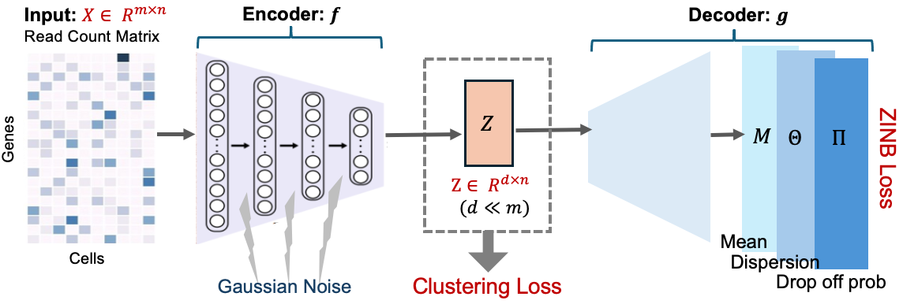

**scDeepCluster**, a ZINB Autoencoder-based deep embedding clustering Method for Single Cell RNA-seq data. 

Network diagram:

**scAce**, a ZINB Variational Autoencoder-based deep embedding clustering Method, with cluster merging step, for Single Cell RNA-seq data. 

Network Diagram:

**References:**

Tian, T., Wan, J., Song, Q., & Wei, Z. (2019). Clustering single-cell RNA-seq data with a model-based deep learning
approach. Nature Machine Intelligence, 1(4), 191-198. https://www.nature.com/articles/s42256-019-0037-0.
https://github.com/ttgump/scDeepCluster

He, X., Qian, K., Wang, Z., Zeng, S., Li, H., & Li, W. V. (2023). scAce: an adaptive embedding and clustering method for single-cell gene expression data. Bioinformatics, 39(9), btad546.
https://doi.org/10.1093/bioinformatics/btad546
https://github.com/sldyns/scAce

